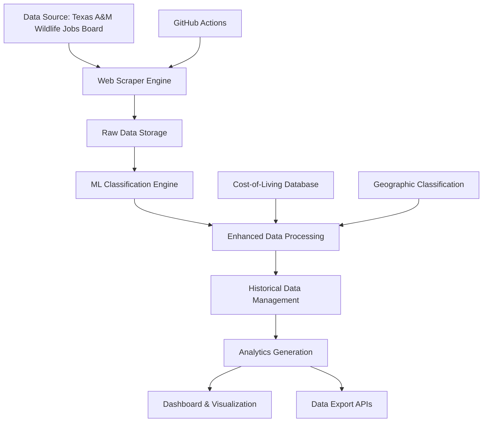
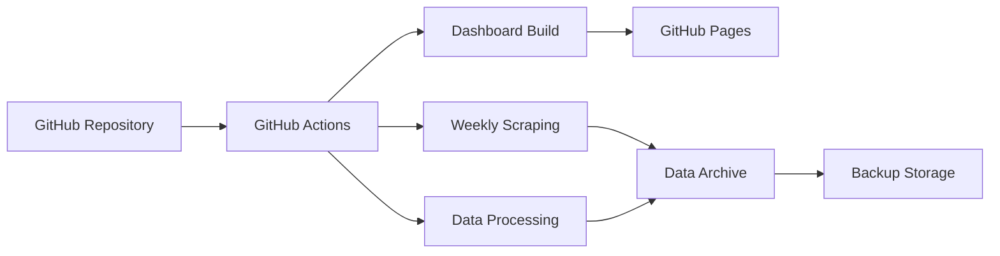

# Wildlife Graduate Assistantships Analytics Platform
## Product Requirements Document

### Version: 2.0
### Date: July 24, 2025
### Status: Active Development

---

## 📋 Executive Summary

The Wildlife Graduate Assistantships Analytics Platform is a comprehensive research and policy analysis tool designed to track, analyze, and provide insights into graduate-level employment opportunities in wildlife, fisheries, and natural resources fields. The platform serves academic researchers, policy makers, and institutional planners by providing data-driven insights into job market trends, salary analysis, and geographic distribution of opportunities.

### Key Value Propositions
- **Market Intelligence**: Real-time tracking of graduate assistantship opportunities across wildlife and natural resources disciplines
- **Trend Analysis**: Historical data analysis to identify market patterns, seasonal trends, and emerging opportunities
- **Policy Insights**: Geographic and institutional analysis to inform workforce development and policy decisions
- **Academic Research**: Comprehensive dataset for scholarly research on academic job markets and career pathways

---

## 🎯 Product Vision & Objectives

### Vision Statement
To provide the definitive platform for understanding and analyzing the graduate assistantship job market in wildlife, fisheries, and natural resources, enabling evidence-based decision making for academic programs, policy development, and workforce planning.

### Primary Objectives
1. **Comprehensive Data Collection**: Automated, ethical scraping of graduate assistantship opportunities from academic job boards
2. **Intelligent Classification**: ML-powered position categorization and discipline classification with 94%+ accuracy
3. **Advanced Analytics**: Historical trend analysis, salary normalization, and geographic insights
4. **Research-Grade Outputs**: Publication-quality data and visualizations for academic and policy research

---

## 👥 User Personas & Use Cases

### Primary Persona: Academic Researchers
**Profile**: PhD-level researchers studying wildlife career pathways, academic job markets, or workforce development
**Primary Goals**:
- Access historical job market data for longitudinal studies
- Analyze salary trends and geographic distribution of opportunities
- Generate publication-quality datasets and visualizations
- Track discipline-specific employment patterns

**Key Use Cases**:
- Export comprehensive datasets for statistical analysis
- Generate trend reports for grant applications
- Compare regional job market characteristics
- Analyze correlation between academic programs and job availability

### Secondary Persona: Policy Analysts & Institutional Planners
**Profile**: Government agencies, university administrators, and professional organizations
**Primary Goals**:
- Inform workforce development strategies
- Assess regional needs for wildlife professionals
- Evaluate program effectiveness and market alignment
- Support funding and resource allocation decisions

**Key Use Cases**:
- Generate regional workforce analysis reports
- Track emerging specializations and skill demands
- Assess program-to-career alignment
- Monitor salary competitiveness across regions

### Tertiary Persona: Academic Program Directors
**Profile**: Faculty and administrators managing graduate programs in wildlife-related fields
**Primary Goals**:
- Understand job market for their graduates
- Identify emerging research areas and opportunities
- Assess program competitiveness and outcomes
- Support student career planning and placement

---

## 🏗️ System Architecture

### High-Level Architecture



### Core Components

#### 1. **Data Collection Layer**
- **Web Scraper Engine** (`wildlife_job_scraper.py`)
  - Anti-detection Selenium WebDriver implementation
  - Ethical scraping with 2-5 second delays and user-agent rotation
  - Comprehensive pagination and error handling
  - Detailed job content extraction including descriptions and requirements

#### 2. **Data Processing Layer**
- **ML Classification Engine** (`src/analysis/enhanced_analysis.py`)
  - TF-IDF vectorization with cosine similarity for discipline classification
  - Graduate position detection with confidence scoring
  - 11 discipline categories with hierarchical classification
  - Position type classification (Graduate/Professional/Technician)

- **Enhancement Processors**
  - Cost-of-living salary adjustment to Lincoln, NE baseline
  - Geographic region classification and university categorization
  - Historical data deduplication and versioning
  - Temporal trend analysis and seasonal pattern detection

#### 3. **Data Storage Layer**
- **Raw Data**: JSON/CSV exports of scraped positions
- **Processed Data**: Enhanced positions with ML classifications
- **Historical Data**: Deduplicated time-series data with versioning
- **Analytics Cache**: Pre-computed statistics and aggregations
- **Archive System**: Timestamped backups for longitudinal studies

#### 4. **Analytics & Visualization Layer**
- **Interactive Dashboards**: Real-time filtering and visualization
- **Export APIs**: JSON/CSV data export for research use
- **Trend Analysis**: Historical pattern identification and forecasting
- **Comparative Analytics**: Regional, temporal, and institutional comparisons

---

## ⚙️ Functional Requirements

### FR-1: Data Collection & Scraping
**Priority**: Critical
**Description**: Automated collection of graduate assistantship data from academic job boards

**Requirements**:
- **FR-1.1**: Scrape job listings from Texas A&M Wildlife and Fisheries job board
- **FR-1.2**: Extract comprehensive job metadata (title, organization, location, salary, dates, descriptions)
- **FR-1.3**: Handle pagination and dynamic content loading
- **FR-1.4**: Implement anti-detection measures and rate limiting
- **FR-1.5**: Support keyword-based filtering for graduate-level positions
- **FR-1.6**: Generate unique run IDs for tracking and versioning
- **FR-1.7**: Store raw data in multiple formats (JSON, CSV)

### FR-2: Machine Learning Classification
**Priority**: Critical
**Description**: Intelligent categorization of positions using ML algorithms

**Requirements**:
- **FR-2.1**: Classify positions as Graduate/Professional/Technician with confidence scores
- **FR-2.2**: Categorize disciplines into 11 primary categories using TF-IDF + cosine similarity
- **FR-2.3**: Achieve 94%+ accuracy on graduate position classification
- **FR-2.4**: Support hierarchical discipline classification (primary/secondary)
- **FR-2.5**: Provide confidence scores for all ML classifications
- **FR-2.6**: Handle classification of incomplete or ambiguous job descriptions
- **FR-2.7**: Support retraining and model updates

### FR-3: Data Enhancement & Processing
**Priority**: High
**Description**: Enrich raw data with geographic, economic, and institutional metadata

**Requirements**:
- **FR-3.1**: Adjust salaries to Lincoln, NE cost-of-living baseline
- **FR-3.2**: Parse and normalize salary ranges, formats, and currencies
- **FR-3.3**: Classify geographic regions and cost-of-living indices for 70+ cities
- **FR-3.4**: Identify and tag Big 10 and R1 research universities
- **FR-3.5**: Extract and parse location data from free-text fields
- **FR-3.6**: Generate standardized organization names and classifications
- **FR-3.7**: Support international position processing and currency conversion

### FR-4: Historical Data Management
**Priority**: High
**Description**: Maintain longitudinal dataset with deduplication and versioning

**Requirements**:
- **FR-4.1**: Deduplicate positions using hash-based matching (title+org+location)
- **FR-4.2**: Track first_seen and last_updated timestamps for all positions
- **FR-4.3**: Maintain historical archives with timestamped backups
- **FR-4.4**: Support data migration and schema evolution
- **FR-4.5**: Generate merge statistics and data quality reports
- **FR-4.6**: Handle position updates and status changes
- **FR-4.7**: Preserve data lineage and audit trails

### FR-5: Analytics & Insights Generation
**Priority**: High
**Description**: Generate comprehensive analytics and trend analysis

**Requirements**:
- **FR-5.1**: Calculate temporal trends and seasonal patterns
- **FR-5.2**: Generate salary statistics by discipline, region, and institution type
- **FR-5.3**: Analyze geographic distribution and regional concentrations
- **FR-5.4**: Track discipline-specific trends and emerging specializations
- **FR-5.5**: Calculate position type distributions and confidence metrics
- **FR-5.6**: Generate comparative analysis across time periods
- **FR-5.7**: Support custom analytics queries and aggregations

### FR-6: Interactive Dashboard & Visualization
**Priority**: Medium
**Description**: Web-based analytics dashboard for data exploration

**Requirements**:
- **FR-6.1**: Interactive filtering by discipline, location, salary, and date
- **FR-6.2**: Real-time search across all position fields
- **FR-6.3**: Multiple visualization types (charts, maps, tables)
- **FR-6.4**: Export capabilities for filtered datasets
- **FR-6.5**: Mobile-responsive design for accessibility
- **FR-6.6**: Performance optimization for large datasets (1,500+ positions)
- **FR-6.7**: Print-friendly layouts for report generation

### FR-7: Data Export & API Access
**Priority**: Medium
**Description**: Programmatic access to datasets for research use

**Requirements**:
- **FR-7.1**: Export filtered datasets in JSON and CSV formats
- **FR-7.2**: Support bulk data downloads for academic research
- **FR-7.3**: Generate analytics summaries and statistical reports
- **FR-7.4**: Provide metadata documentation for all exports
- **FR-7.5**: Support custom field selection and filtering
- **FR-7.6**: Generate citation information for academic use
- **FR-7.7**: Maintain export logs and usage analytics

### FR-8: Automation & Scheduling
**Priority**: Medium
**Description**: Automated data collection and processing workflows

**Requirements**:
- **FR-8.1**: Weekly automated scraping via GitHub Actions
- **FR-8.2**: Automatic data processing and ML classification
- **FR-8.3**: Dashboard deployment and cache updates
- **FR-8.4**: Error handling and notification systems
- **FR-8.5**: Backup generation and archive management
- **FR-8.6**: Health monitoring and performance tracking
- **FR-8.7**: Graceful failure recovery and retry mechanisms

---

## 🔧 Non-Functional Requirements

### NFR-1: Performance
- **NFR-1.1**: Dashboard load time < 1.5s First Contentful Paint
- **NFR-1.2**: ML classification processing > 200 positions/second
- **NFR-1.3**: Search response time < 100ms for real-time filtering
- **NFR-1.4**: Support concurrent users without degradation
- **NFR-1.5**: Handle datasets up to 10,000 positions efficiently

### NFR-2: Scalability
- **NFR-2.1**: Horizontal scaling for increased data volume
- **NFR-2.2**: Modular architecture supporting component replacement
- **NFR-2.3**: Database optimization for historical data growth
- **NFR-2.4**: CDN integration for global accessibility
- **NFR-2.5**: Auto-scaling for peak usage periods

### NFR-3: Security & Privacy
- **NFR-3.1**: XSS protection with comprehensive input sanitization
- **NFR-3.2**: Secure data storage and transmission
- **NFR-3.3**: Privacy compliance for publicly available data only
- **NFR-3.4**: Audit logging for data access and modifications
- **NFR-3.5**: Regular security vulnerability scanning

### NFR-4: Accessibility & Usability
- **NFR-4.1**: WCAG 2.1 AA compliance for accessibility
- **NFR-4.2**: Keyboard navigation and screen reader support
- **NFR-4.3**: Mobile-first responsive design
- **NFR-4.4**: High contrast and reduced motion support
- **NFR-4.5**: Intuitive user interface with minimal learning curve

### NFR-5: Reliability & Availability
- **NFR-5.1**: 99.5% uptime for dashboard and data access
- **NFR-5.2**: Graceful error handling and user feedback
- **NFR-5.3**: Automated backup and disaster recovery
- **NFR-5.4**: Data integrity verification and validation
- **NFR-5.5**: Fault tolerance for external dependencies

### NFR-6: Maintainability
- **NFR-6.1**: Modular, well-documented codebase
- **NFR-6.2**: Comprehensive test coverage (>80%)
- **NFR-6.3**: Clear separation of concerns and clean architecture
- **NFR-6.4**: Version control and deployment automation
- **NFR-6.5**: Monitoring and alerting systems

---

## 📊 Data Specifications

### Primary Data Schema

#### Position Record
```json
{
  "position_id": "string (unique hash identifier)",
  "title": "string (job title)",
  "organization": "string (hiring institution)",
  "location": "string (geographic location)",
  "salary": "string (original salary text)",
  "starting_date": "string (position start date)",
  "published_date": "string (posting publication date)",
  "tags": "string (job categories/tags)",
  "description": "string (full job description)",
  "requirements": "string (position requirements)",
  "project_details": "string (research project information)",
  "contact_info": "string (contact information)",
  "application_deadline": "string (application deadline)",

  "is_graduate_position": "boolean (ML classification)",
  "grad_confidence": "float (0-1 confidence score)",
  "position_type": "string (Graduate/Professional/Technician)",

  "discipline": "string (primary discipline category)",
  "discipline_confidence": "float (0-1 confidence score)",
  "discipline_keywords": "array (matching keywords)",

  "salary_lincoln_adjusted": "float (cost-adjusted salary)",
  "cost_of_living_index": "float (location cost index)",
  "geographic_region": "string (regional classification)",
  "is_big10_university": "boolean (university classification)",
  "university_name": "string (standardized name)",

  "first_seen": "string (ISO timestamp)",
  "last_updated": "string (ISO timestamp)",
  "scraped_at": "string (ISO timestamp)",
  "scrape_run_id": "string (batch identifier)",
  "scraper_version": "string (version tracking)"
}
```

#### Analytics Summary Schema
```json
{
  "summary": {
    "total_positions": "integer",
    "graduate_positions": "integer",
    "avg_salary_lincoln": "float",
    "data_freshness": "string (ISO timestamp)"
  },
  "disciplines": {
    "Wildlife Management and Conservation": {
      "total_positions": "integer",
      "grad_positions": "integer",
      "salary_stats": {
        "mean": "float",
        "median": "float",
        "min": "float",
        "max": "float",
        "count": "integer"
      }
    }
  },
  "geographic_analytics": {
    "by_region": "object (region: count)",
    "by_state": "object (state: count)",
    "cost_of_living_analysis": "object"
  },
  "temporal_trends": {
    "monthly_counts": "object (YYYY-MM: count)",
    "seasonal_patterns": "object",
    "growth_rates": "object"
  }
}
```

### Data Quality Standards
- **Completeness**: 95% of records must have title, organization, and location
- **Accuracy**: ML classifications must maintain 94%+ precision
- **Consistency**: Standardized formats for dates, salaries, and locations
- **Freshness**: Weekly data updates with timestamp tracking
- **Integrity**: Hash-based deduplication with 99.9% accuracy

---

## 🎯 Success Metrics & KPIs

### Data Collection Metrics
- **Coverage**: >95% of relevant graduate assistantships captured
- **Accuracy**: <2% false positive rate for graduate position classification
- **Completeness**: >90% of positions with detailed descriptions
- **Freshness**: Data updates within 7 days of posting
- **Reliability**: >99% successful scraping runs

### Analytics Quality Metrics
- **Classification Precision**: >94% for discipline categorization
- **Salary Normalization**: <5% error rate in cost-of-living adjustments
- **Geographic Accuracy**: >95% correct location parsing
- **Historical Integrity**: Zero data loss in historical archiving
- **Processing Speed**: <30 seconds for full dataset analysis

### User Experience Metrics
- **Dashboard Performance**: <1.5s load time, <100ms search response
- **Accessibility**: 100% WCAG 2.1 AA compliance
- **Mobile Experience**: Fully functional on all device sizes
- **Error Rate**: <1% user-facing errors
- **Export Success**: >99% successful data exports

### Research Impact Metrics
- **Dataset Downloads**: Track academic and policy use
- **Citation Tracking**: Monitor research publications using the data
- **User Feedback**: >4.5/5 satisfaction score from researchers
- **Data Requests**: Response to custom analytics requests
- **Platform Growth**: Year-over-year increase in research usage

---

## 🚀 Technical Implementation

### Technology Stack
- **Backend**: Python 3.9+ with Selenium, Pydantic, pandas
- **ML/Analytics**: scikit-learn, TF-IDF, cosine similarity
- **Frontend**: Vanilla JavaScript ES6+, Chart.js, Plotly
- **Data Storage**: JSON files with automatic backup and versioning
- **Automation**: GitHub Actions for CI/CD and scheduling
- **Deployment**: GitHub Pages with CDN optimization

### Development Standards
- **Code Quality**: PEP 8 compliance, type hints, comprehensive logging
- **Testing**: pytest with >80% coverage, automated testing in CI/CD
- **Documentation**: Google-style docstrings, comprehensive README files
- **Security**: XSS prevention, input sanitization, vulnerability scanning
- **Performance**: Profiling, optimization, and monitoring

### Deployment Architecture


---

## 📈 Roadmap & Future Enhancements

### Phase 1: Current Capabilities (Complete)
- [x] Automated web scraping with ML classification
- [x] Historical data management and trend analysis
- [x] Interactive analytics dashboard
- [x] Cost-of-living adjusted salary analysis
- [x] Geographic and institutional categorization

### Phase 2: Enhanced Analytics (Planned)
- [ ] Predictive modeling for job market trends
- [ ] Advanced geographic visualization and mapping
- [ ] Salary forecasting and regional comparisons
- [ ] Integration with additional job boards
- [ ] API development for programmatic access

### Phase 3: Research Platform (Future)
- [ ] User authentication and personalized dashboards
- [ ] Collaborative analysis tools for research teams
- [ ] Advanced statistical analysis and hypothesis testing
- [ ] Integration with academic databases and publications
- [ ] Mobile application for field researchers

---

## 🤝 Stakeholder Analysis

### Primary Stakeholders
- **Academic Researchers**: Primary users requiring comprehensive, accurate data
- **Policy Analysts**: Secondary users needing trend analysis and insights
- **System Maintainers**: Technical team ensuring platform reliability
- **Data Sources**: Texas A&M Wildlife Jobs Board and potential future sources

### Secondary Stakeholders
- **Graduate Students**: Indirect beneficiaries through improved career resources
- **Academic Institutions**: Users of workforce development insights
- **Professional Organizations**: Consumers of industry trend analysis
- **Funding Agencies**: Supporters requiring impact demonstration

---

## 🔍 Risk Assessment & Mitigation

### Technical Risks
- **Web Scraping Changes**: Source website modifications breaking scraper
  - *Mitigation*: Robust error handling, multiple parsing strategies, monitoring
- **ML Model Drift**: Classification accuracy degradation over time
  - *Mitigation*: Regular model evaluation, retraining procedures, confidence monitoring
- **Data Quality Issues**: Incomplete or inaccurate source data
  - *Mitigation*: Multiple validation layers, data quality metrics, manual review processes

### Operational Risks
- **GitHub Actions Limitations**: Platform constraints affecting automation
  - *Mitigation*: Alternative hosting options, backup automation systems
- **Storage Limitations**: Data volume exceeding platform capacity
  - *Mitigation*: Data archiving strategies, external storage integration
- **Performance Degradation**: Increased load affecting user experience
  - *Mitigation*: Performance monitoring, optimization strategies, CDN usage

### Compliance Risks
- **Data Privacy**: Inadvertent collection of personal information
  - *Mitigation*: Data filtering, privacy review processes, legal compliance
- **Terms of Service**: Violation of source website policies
  - *Mitigation*: Ethical scraping practices, rate limiting, legal review
- **Accessibility Compliance**: Failure to meet accessibility standards
  - *Mitigation*: Regular accessibility audits, WCAG compliance testing

---

## 📋 Acceptance Criteria

### Data Collection
- [ ] Successfully scrape 95%+ of available graduate assistantships
- [ ] Maintain <2% error rate in data extraction
- [ ] Complete weekly scraping runs without manual intervention
- [ ] Generate comprehensive audit logs for all data collection

### Machine Learning
- [ ] Achieve 94%+ accuracy in graduate position classification
- [ ] Provide confidence scores for all ML predictions
- [ ] Support retraining and model updates without data loss
- [ ] Handle edge cases and ambiguous classifications gracefully

### Analytics Dashboard
- [ ] Load dashboard in <1.5 seconds on standard connections
- [ ] Support real-time filtering and search across all data
- [ ] Maintain responsive design across all device sizes
- [ ] Provide accessibility features meeting WCAG 2.1 AA standards

### Data Export
- [ ] Export filtered datasets in JSON and CSV formats
- [ ] Generate analytics summaries with statistical confidence
- [ ] Provide comprehensive metadata and documentation
- [ ] Support bulk downloads for academic research use

### System Reliability
- [ ] Maintain 99.5% uptime for all user-facing components
- [ ] Implement automated backup and recovery procedures
- [ ] Provide comprehensive error handling and user feedback
- [ ] Generate detailed system health and performance reports

---

## 📞 Support & Maintenance

### Documentation Requirements
- **User Guide**: Comprehensive documentation for researchers and analysts
- **Technical Documentation**: Architecture, API specifications, and deployment guides
- **Data Dictionary**: Complete schema documentation with examples
- **Research Guidelines**: Best practices for academic use of the platform

### Maintenance Procedures
- **Weekly Monitoring**: Data collection success, system performance, error rates
- **Monthly Reviews**: ML model performance, data quality, user feedback
- **Quarterly Updates**: System updates, security patches, feature enhancements
- **Annual Assessments**: Platform strategy, technology updates, capacity planning

### Support Channels
- **GitHub Issues**: Primary channel for bug reports and feature requests
- **Documentation Portal**: Self-service resources and troubleshooting guides
- **Academic Support**: Direct assistance for research applications
- **Technical Support**: System administrators and development team contact
